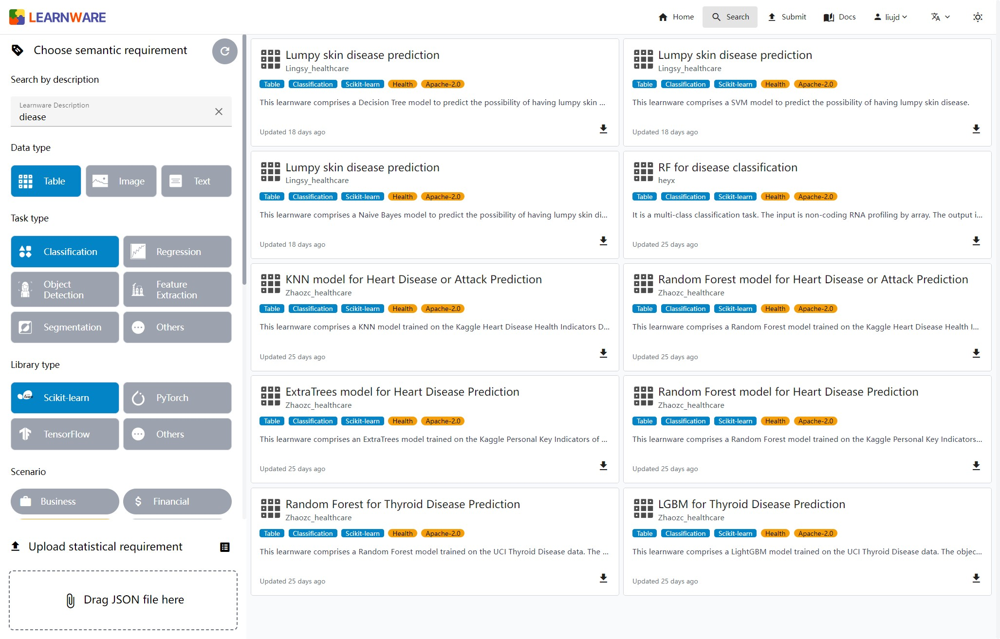
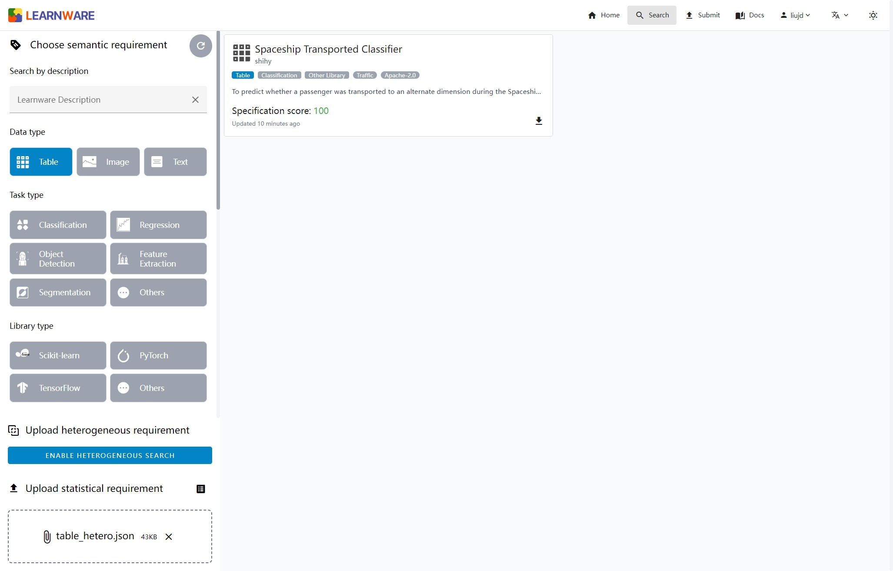
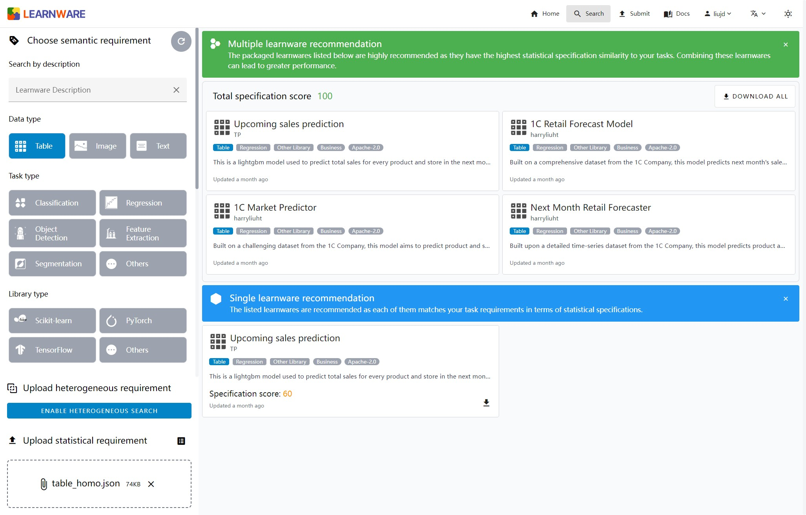

<div align=center>
  
  <br/>
  <br/>
</div>

<p align="center">
    <a href="https://github.com/Learnware-LAMDA/Beimingwu/blob/main/LICENSE">
        
    </a>
    <a href="https://bmwu.cloud/">
        
    </a>
    <a href="https://github.com/Learnware-LAMDA/Beimingwu/issues">
        
    </a>
    <a href="https://GitHub.com/Learnware-LAMDA/Beimingwu/pull/">
        
    </a>
    <a href="https://GitHub.com/Learnware-LAMDA/Beimingwu/commit/">
        
    </a>
    <a href="https://docs.bmwu.cloud/">
        
    </a>
</p>

<h3 align="center">
    <p>Beimingwu: The First Learnware Dock System</p>
    <p>A Systematic Implementation of Learnware Paradigm</p>
    <p>
        <b>English</b> |
        <a href="https://github.com/Learnware-LAMDA/Beimingwu/blob/main/README_zh.md">中文</a>
    </p>
</h3>

# Introduction

The _learnware_ paradigm, proposed by Professor Zhi-Hua Zhou in 2016 [1, 2], aims to build a vast model platform system, i.e., a _learnware dock system_, which systematically accommodates and organizes models shared by machine learning developers worldwide, and can efficiently identify and assemble existing helpful model(s) to solve future tasks in a unified way.

Based on the _learnware_ paradigm, Beimingwu systematically implements the entire process of learnware from submission to deployment, helping users effectively search and reuse learnwares without the need to build machine learning models from scratch. A learnware is a well-performed trained model with a specification describing its capabilities. The specification includes a semantic specification in text and a statistical specification sketching the model's statistical information.

[1] Zhi-Hua Zhou. Learnware: on the future of machine learning. _Frontiers of Computer Science_, 2016, 10(4): 589–590 <br/>
[2] Zhi-Hua Zhou. Machine Learning: Development and Future. _Communications of CCF_, 2017, vol.13, no.1 (2016 CNCC keynote)

## What features does Beimingwu have?

As shown in the diagram below, Beimingwu systematically implements the core process of the learnware paradigm for the first time:

- **Submitting Stage**: The system includes multiple detection mechanisms to ensure the quality of uploaded learnwares. Additionally, the system trains a heterogeneous engine based on existing learnware specifications in the system to merge different specification islands and assign new specifications to learnwares. With more learnwares are submitted, the heterogeneous engine will continue to update, achieving continuous iteration of learnware specifications and building a more precise specification world.
- **Deploying Stage**: After users upload task requirements, the system automatically selects whether to recommend a single learnware or multiple learnware combinations and provides efficient deployment methods. Whether it's a single learnware or a combination of multiple learnwares, the system offers convenient learnware reuse tools.

<div align=center>
  
</div>

In addition, the Beimingwu system also has the following features:

- **Learnware Specification Generation**: The Beimingwu system provides specification generation interfaces in the `learnware` Python package, supporting various data types (tables, images, and text) for efficient local generation.
- **Learnware Quality Inspection**: The Beimingwu system includes multiple detection mechanisms to ensure the quality of each learnware in the system.
- **Diverse Learnware Search**: The Beimingwu system supports both semantic specifications and statistical specifications searches, covering data types such as tables, images, and text. In addition, for table-based tasks, the system also supports the search for heterogeneous table learnwares.
- **Local Learnware Deployment**: The Beimingwu system provides interfaces for learnware deployment and learnware reuse in the `learnware` Python package, facilitating users' convenient and secure learnware deployment.
- **Data Privacy Protection**: The Beimingwu system operations, including learnware upload, search, and deployment, do not require users to upload local data. All relevant statistical specifications are generated locally by users, ensuring data privacy.
- **Fully Open Source**: The Beimingwu system's source code is completely open-source, including the `learnware` Python package and frontend/backend code. The `learnware` package is highly extensible, making it easy to integrate new specification designs, learnware system designs, and learnware reuse methods in the future.

## How is Beimingwu organized?

### System Architecture

As depicted in the figure below, Beimingwu's architecture consists of four hierarchical layers, from the learnware storage layer to the user interaction layer, systematically implementing the learnware paradigm for the first time from the ground up.

The functionalities of the four layers are described as follows:
- `Learnware Storage Layer`: Manage the storage of learnwares in zip packages and provides access to them through the learnware database.
- `Core Engine Layer`: Encompass all processes within the learnware paradigm, including learnware uploading, searching, reusing, and deployment, and operate independently of the backend and frontend, offering rich algorithmic interfaces for learnware-related tasks and research experiments.
- `System Backend Layer`: Enable industrial-level deployment of Beimingwu, offering stable online deployment and providing extensive backend APIs for frontend and client interactions.
- `User Interface Layer`: Comprise a web-based frontend and a command-line client for user convenience and interaction.

<div align=center>
  
</div>

### Project Structure

Based on the system architecture, Beimingwu is developed with five sub-projects:
- [`Engine`](https://github.com/Learnware-LAMDA/Learnware): Encompassing core components and algorithms within the learnware paradigm, and providing a command-line client for user interaction, it has been releasead as the [learnware](https://pypi.org/project/learnware/) package.
- [`Frontend`](https://github.com/Learnware-LAMDA/Beimingwu/tree/main/frontend): Provide the interface and functionality for user interaction with the learnware dock system, including the main system and administrator system.
- [`Backend`](https://github.com/Learnware-LAMDA/Beimingwu/tree/main/backend): Responsible for handling the dock system's operation logic and data operations, it ensures system stability and high performance.
- [`Docs`](https://github.com/Learnware-LAMDA/Beimingwu/tree/main/docs): Maintain system documentation, including user guides, development guides, etc., ensuring system usability.
- [`Deploy`](https://github.com/Learnware-LAMDA/Beimingwu/tree/main/deploy): Manage the system deployment configuration, including frontend and backend deployment files.

# Quick Start

Welcome to experience [Beimingwu](https://bmwu.cloud/). The following instructions will assist you in quickly exploring the search functionality on the system website and provide two demo cases from learnware search to learnware deployment using the [learnware](https://github.com/Learnware-LAMDA/Learnware) package.

The installation instructions for the learnware package can be found here: [Installation Guide](docs/content/en/overview/installation.md).

## Learnware Search

In Beimingwu, learnwares can be searched using both semantic information and statistical information.

When searching with semantic information, you can fill in the information about your target learnware, and the system will search in the names and descriptions of learnwares. You can also filter by tags.



When searching with statistical information, you need to submit the statistical information of the task. The tools we provide will generate approximate statistical information for your task locally while protecting your data privacy. With the following code, you can easily generate approximate statistical information for your task.

```python
from learnware.specification import generate_stat_spec

data_type = "table"  # Data types: ["table", "image", "text"]
spec = generate_stat_spec(type=data_type, X=test_x)
spec.save("stat.json")
```

By uploading the JSON file containing statistical information, the system will match learnware with similar statistical information. You can download the learnware zip by clicking on the download button in the lower left corner of the learnware card.



In some cases, combining multiple learnwares with similar statistical information may be more suitable for your task. The system will recommend these learnwares as a package to you. You can download all of them with the "Download All" button in the upper right corner.



## Demo Cases

Beimingwu offers a complete workflow from learnware search to learnware deployment. Below are two specific examples.

### Single Learnware Demo

The following demo illustrates the complete process of using Beimingwu to search for a single learnware for predicting the classic machine learning dataset Iris. This process includes statistical specification generation, single learnware search, learnware deployment, and the final calculation of prediction accuracy.

```python
from learnware.market import BaseUserInfo
from learnware.specification import generate_stat_spec
from learnware.client import LearnwareClient
from sklearn.datasets import load_iris
from sklearn.metrics import accuracy_score

# User prepare
client = LearnwareClient()
client.login(your_email, your_token)
data, target = load_iris(return_X_y=True)
# Generate statistical specification
rkme = generate_stat_spec(type="table", X=data)
user_info = BaseUserInfo(stat_info={rkme.type: rkme})

# Search a single learnware
learnware_id = client.search_learnware(user_info)["single"]["learnware_ids"][0]
print(f"Search result: {learnware_id}")

# Load learnware
learnware = client.load_learnware(learnware_id=learnware_id, runnable_option="conda")

# Reuse learnware
y_pred = learnware.predict(data)
print(f"Classification accuracy: {accuracy_score(target, y_pred)}")
```

### Multiple Learnwares Demo

The following demo illustrates the complete process of using Beimingwu to search for multiple learnwares for predicting the classic machine learning dataset Digits. This process includes statistical specification generation, multiple learnware search, learnware deployment, and the final calculation of prediction accuracy.

```python
from learnware.market import BaseUserInfo
from learnware.specification import generate_stat_spec
from learnware.client import LearnwareClient
from learnware.reuse import AveragingReuser
from sklearn.datasets import load_digits
from sklearn.metrics import accuracy_score

# User prepare
client = LearnwareClient()
client.login(your_email, your_token)
data, target = load_digits(return_X_y=True)
# Generate statistical specification
rkme = generate_stat_spec(type="table", X=data)
user_info = BaseUserInfo(stat_info={rkme.type: rkme})

# Search multiple learnwares
learnware_ids = client.search_learnware(user_info)["multiple"]["learnware_ids"]
print(f"Search result: {learnware_ids}")

# Load learnware
learnware_list = client.load_learnware(learnware_id=learnware_ids, runnable_option="conda")

# Reuse learnware
y_pred = AveragingReuser(learnware_list, mode="vote_by_label").predict(data)
print(f"Classification accuracy: {accuracy_score(target, y_pred)}")
```

# About

## How to Contribute

Beimingwu is still young and may contain bugs and issues. We highly value and encourage contributions from the community. For detailed development guidelines, please consult our [Developer Guide](https://docs.bmwu.cloud/en/developer-guide/structure-and-guidelines.html). We kindly request that contributors adhere to the provided [Development Standards](https://docs.bmwu.cloud/en/developer-guide/structure-and-guidelines.html#development-standards) when participating in the project. Your valuable contributions are greatly appreciated.

## Contact us

If you encounter any problems or have suggestions while using [Beimingwu](https://bmwu.cloud/), please don't hesitate to contact us:

- Email: bmwu-support@lamda.nju.edu.cn