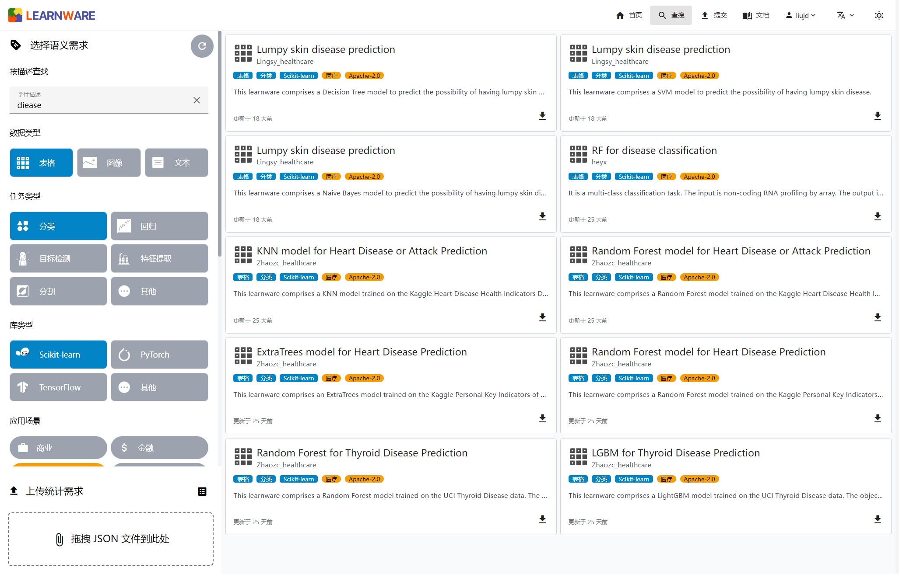
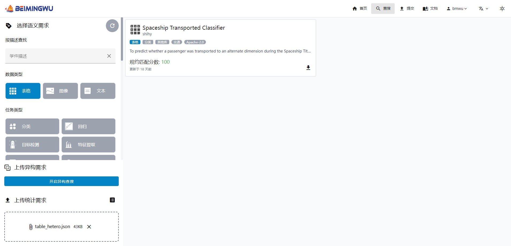
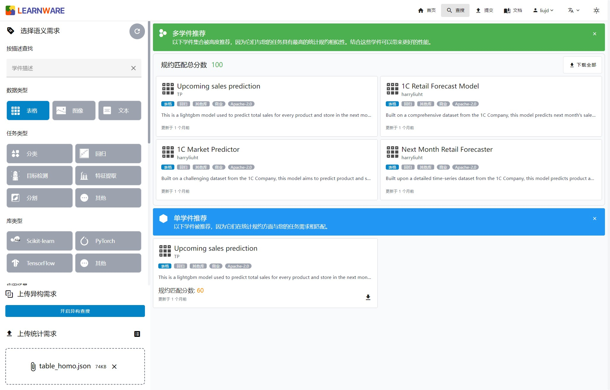

<div align=center>
  
  <br/>
  <br/>
</div>

<div align="center">
    <a href="LICENSE">
        
    </a>
    <a href="https://bmwu.cloud/">
        
    </a>
    <a href="https://pypi.org/project/learnware/#history">
        
    </a>
    <a href="https://pypi.org/project/learnware/#files">
        
    </a>
    <a href="https://docs.bmwu.cloud/">
        
    </a>
    <a href="https://img.shields.io/pypi/dm/example-package">
        
    </a>
</div>

<div>
    <h3 align="center">北冥坞：学件基座系统</h3>
    <h3 align="center">学件科研平台</h3>
    <h3 align="center">
        <b>中文</b> |
        <a href="README.md">English</a>
    </h3>
</div>

# 简介

学件由周志华教授在 2016 年提出 [1, 2]。在学件范式下，世界各地的开发者可分享模型至学件基座系统，系统通过有效查搜和复用学件帮助用户高效解决机器学习任务，而无需从零开始构建机器学习模型。

北冥坞是学件的第一个系统性开源实现，为学件相关研究提供了一个初步科研平台。有分享意愿的开发者可自由提交模型，学件坞协助产生规约形成学件存放在学件坞中，开发者在这个过程中无需向学件坞泄露自己的训练数据。未来的用户可以通过向学件坞提交需求，在学件坞协助下查搜复用学件来完成自己的机器学习任务，且用户可以不向学件坞泄露自有数据。预计在学件坞拥有数以百万计的学件后，将可能出现“涌现”行为：以往没有专门开发过模型的机器学习任务，可能通过复用若干个现有学件而解决。

学件由性能优良的机器学习模型和描述模型的规约组成。规约刻画了模型的能力，使得模型在未来能够根据用户需求被充分识别和复用。规约由两部分构成：语义规约通过文本描述模型的功能，而统计规约刻画模型所蕴含的统计信息。

[1] Zhi-Hua Zhou. Learnware: on the future of machine learning. Frontiers of Computer Science, 2016, 10(4): 589–590 <br/>
[2] 周志华. 机器学习: 发展与未来. 中国计算机学会通讯, 2017, vol.13, no.1 (2016 中国计算机大会 keynote)

## 北冥坞系统有哪些特性？

如下图所示，北冥坞学件基座系统作为学件的初步科研平台，首次实现了学件范式中的核心流程：

- **提交阶段**：系统内置了多重检测机制，以确保上传学件的质量。另外，系统会根据已有的学件规约，训练一个异构引擎，用于合并不同的规约岛屿，以及为学件赋予新规约。随着更多学件的上传，系统的异构引擎将持续更新，目标是通过系统内学件规约的持续迭代，构建更加精准的规约世界。
- **部署阶段**：用户上传任务需求后，系统会自动选择是推荐单学件还是多学件组合，并提供高效的部署方式。无论是单个学件还是多学件组合，系统均提供了便捷的学件复用接口。

<div align=center>
  
</div>

此外，北冥坞系统还具备以下特性：

- **学件规约生成**：北冥坞系统在 `learnware` Python 包中提供规约生成接口，支持多种数据类型（表格、图像和文本），可以在本地高效生成。
- **学件质量检测**：北冥坞系统内置了多重检测机制，以确保系统中每个学件的质量。
- **学件多样查搜**：北冥坞系统同时支持语义规约和统计规约的查搜，覆盖的数据类型包括表格、图像、文本。另外，对于表格型任务，系统额外支持初步的异构表格学件的查搜。
- **学件本地部署**：北冥坞系统在 `learnware` Python 包中同时提供学件部署与学件复用的接口，帮助用户以统一的方式便携地部署与复用学件。
- **保护原始数据**：北冥坞系统所涉及的学件上传、查搜、部署均无需用户泄露原始数据，生成统计规约的过程在用户本地进行且代码公开。
- **面向社区开源**：北冥坞系统面向社区开源，包括 `learnware` Python 包与前后端代码。其中 `leanrware` 包高度可扩展，未来新的规约设计、学件系统设计、学件查搜和复用方法都能轻松集成进来。

## 北冥坞系统是如何组织的？

### 系统架构

如下图所示，北冥坞的系统架构包含四个层次，从学件存储层至用户交互层，首次自底向上系统性地实现了学件范式。

四个层次的具体功能如下：

- `学件存储层`：管理以 zip 包格式存储的学件，并通过学件数据库提供相关信息的获取方式；
- `系统引擎层`：囊括了学件范式中的所有流程，包括学件上传、查搜、部署和复用，并独立于后端和前端运行，为学件相关任务和科研探索提供了丰富的算法接口；
- `系统后端层`：实现了北冥坞的工业级部署，提供了稳定的系统在线服务，并通过提供丰富的后端 API 支撑了前端和客户端的用户交互；
- `用户交互层`：实现了基于网页的前端和基于命令行的客户端，为用户交互提供了丰富且便捷的方式。

<div align=center>
  
</div>

### 项目结构

基于上述系统架构，北冥坞项目一共包含如下五个子项目：
- [`系统引擎`](https://github.com/Learnware-LAMDA/Learnware)：实现了学件范式中的核心组件和算法，并提供了一个基于命令行的客户端以便于用户交互，同时将其作为 [learnware](https://pypi.org/project/learnware/) 包发布。
- [`系统前端`](https://github.com/Learnware-LAMDA/Beimingwu/tree/main/frontend)：提供了用户与系统交互的界面和功能，包括主系统和管理员系统。
- [`系统后端`](https://github.com/Learnware-LAMDA/Beimingwu/tree/main/backend)：负责处理系统的运行逻辑和数据操作，确保系统的稳定性和高性能。
- [`系统文档`](https://github.com/Learnware-LAMDA/Beimingwu/tree/main/docs)：维护系统的文档，包括用户指南、开发指南等，确保系统的易用性。
- [`系统部署`](https://github.com/Learnware-LAMDA/Beimingwu/tree/main/deploy)：负责管理系统的部署配置，包括前后端的部署文件。

# 快速上手

欢迎体验[北冥坞系统](https://bmwu.cloud/)！下述内容将帮你快速探索系统网站上的学件查搜功能，并基于 [learnware](https://github.com/Learnware-LAMDA/Learnware) 包提供两个从学件查搜至学件部署的应用案例。

learnware 包的安装可参考：[环境安装](docs/content/zh-CN/overview/installation.md)。

## 学件查搜

在北冥坞系统中，既可以通过语义信息查搜学件，也可以通过统计信息查搜学件。

通过语义信息查搜时，你可以填写目标学件的信息，系统将在学件的名称和描述字段中进行查搜；你也可以通过标签进行筛选。



通过统计信息进行查搜时，您需要提交任务的统计规约。统计规约可以在保护您的原始数据不被泄露的情况下提供任务的统计信息。您可以使用系统提供的工具，通过下列代码在本地生成统计规约。

```python
from learnware.specification import generate_stat_spec

data_type = "table"  # 数据类型范围: ["table", "image", "text"]
spec = generate_stat_spec(type=data_type, X=test_x)
spec.save("stat.json")
```

通过上传统计信息的 JSON 文件，系统会匹配统计信息接近的学件。你可以通过学件卡片左下角的下载按钮进行学件 zip 包的下载。



某些情况下，组合多个学件的统计规约可能更加贴合您的任务需求，系统会将这些学件打包推荐给您。您可以通过右上角的 “下载全部” 按钮进行一键下载。



## 示例

北冥坞提供了从学件搜索到学件部署的完整工作流程。以下是两个具体示例。

请注意，下述示例的执行，需要先在北冥坞系统中[注册](https://bmwu.cloud/register)，并获取用户邮箱和客户端令牌。

### 单学件示例

下述代码示例展示了使用北冥坞查搜单个学件，用于预测经典机器学习数据集 Iris 的完整流程。该流程包括统计规约生成、单学件查搜、学件部署，以及最终预测准确率的计算。

```python
from learnware.market import BaseUserInfo
from learnware.specification import generate_stat_spec
from learnware.client import LearnwareClient
from sklearn.datasets import load_iris
from sklearn.metrics import accuracy_score

# 用户准备
client = LearnwareClient()
client.login(your_email, your_token)
data, target = load_iris(return_X_y=True)
# 生成统计规约
rkme = generate_stat_spec(type="table", X=data)
user_info = BaseUserInfo(stat_info={rkme.type: rkme})

# 查搜单个学件
learnware_id = client.search_learnware(user_info)["single"]["learnware_ids"][0]
print(f"Search result: {learnware_id}")

# 加载学件
learnware = client.load_learnware(learnware_id=learnware_id, runnable_option="conda")

# 复用学件
y_pred = learnware.predict(data)
print(f"Classification accuracy: {accuracy_score(target, y_pred)}")
```

### 多学件示例

下述代码示例展示了使用北冥坞查搜多个学件，用于预测经典机器学习数据集 Digits 的完整流程。该流程包括统计规约生成、多学件查搜、学件部署，以及最终预测准确率的计算。

```python
from learnware.market import BaseUserInfo
from learnware.specification import generate_stat_spec
from learnware.client import LearnwareClient
from learnware.reuse import AveragingReuser
from sklearn.datasets import load_digits
from sklearn.metrics import accuracy_score

# 用户准备
client = LearnwareClient()
client.login(your_email, your_token)
data, target = load_digits(return_X_y=True)
# 生成统计规约
rkme = generate_stat_spec(type="table", X=data)
user_info = BaseUserInfo(stat_info={rkme.type: rkme})

# 查搜多个学件
learnware_ids = client.search_learnware(user_info)["multiple"]["learnware_ids"]
print(f"Search result: {learnware_ids}")

# 加载学件
learnware_list = client.load_learnware(learnware_id=learnware_ids, runnable_option="conda")

# 复用学件
y_pred = AveragingReuser(learnware_list, mode="vote_by_label").predict(data)
print(f"Classification accuracy: {accuracy_score(target, y_pred)}")
```

# 引用

如果您在研究或工作中使用了我们的项目，请引用下述论文，感谢你的支持！

```bibtex
@article{zhou2024learnware,
  title = {Learnware: Small models do big},
  author = {Zhou, Zhi-Hua and Tan, Zhi-Hao},
  journal = {Science China Information Sciences},
  volume = {67},
  number = {1},
  pages = {112102},
  year = {2024}
}

@article{tan2024beimingwu,
  title = {Beimingwu: A learnware dock system}, 
  author = {Tan, Zhi-Hao and Liu, Jian-Dong and Bi, Xiao-Dong and Tan, Peng and Zheng, Qin-Cheng and Liu, Hai-Tian and Xie, Yi and Zou, Xiao-Chuan and Yu, Yang and Zhou, Zhi-Hua},
  journal = {arXiv preprint arXiv:2401.14427},
  year = {2024}
}
```

# 关于

## 如何贡献

学件范式的构建需要社区的共同努力。作为首个学件基座系统，北冥坞还很年轻，可能存在错误和问题。我们诚邀大家基于北冥坞系统上传模型、共同开发完善系统，或进行学件相关算法的研究与改进。我们为所有的开发者提供了详细的[系统开发指南](https://docs.bmwu.cloud/zh-CN/developer-guide/structure-and-guidelines.html)，并制定了相应的[系统开发规范](https://docs.bmwu.cloud/zh-CN/developer-guide/structure-and-guidelines.html#development-standards)，请大家遵守。非常感谢大家的贡献！

## 关于我们

北冥坞仓库由 LAMDA 北冥坞研发团队开发和维护，更多信息可参考：[团队简介](https://docs.bmwu.cloud/zh-CN/about-us.html)。
