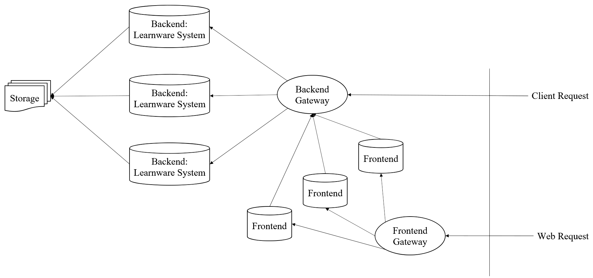

# Beimingwu System Backend

The project is developed based on Flask + SqlAlchemy + Redis, serving as the backend of Beimingwu system.

## Backend Architecture

  

## Feature Development

### Database
Table Definitions: `database/sqlalchemy.py`

Database Operations: `lib/database_operations.py`

### Backend APIs
User APIs: `restful/user.py`

Login APIs: `restful/auth.py`

System Engine APIs: `restful/engine.py`

Admin APIs: `restful/admin.py`

### Test Cases
User test cases: `tests/test_user.py`

Login test cases: `tests/test_auth.py`

System Engine test cases: `tests/test_engine.py`

Admin test cases: `tests/test_admin.py`

### Main Entry Points
Backend Service: `scripts/main.py`

Data Backup: `scripts/backup_data.py`

Learnware Verification: `scripts/monitor_learnware_verify.py`