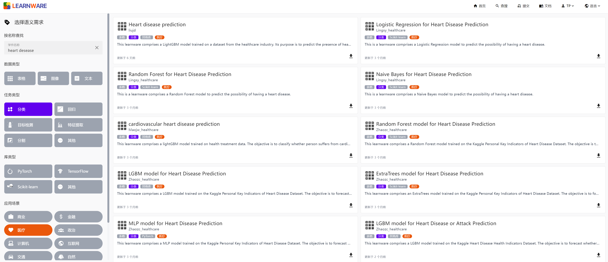
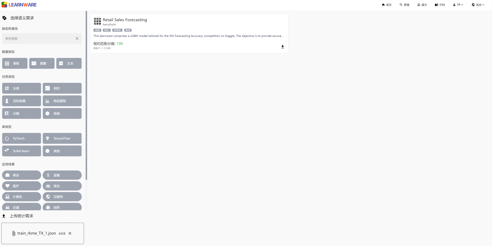
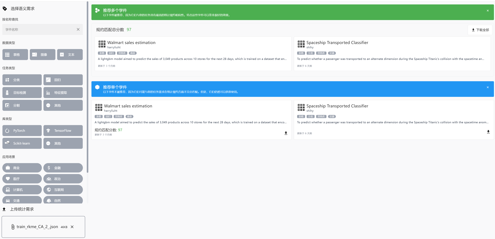

# Quick Start

Welcome to Beimingwu: Learnware Dock System! The following content will help you quickly experience the system, including Learnware Search and Deployment.

## Learnware Search

In Beimingwu, Learnware can be searched using both semantic information and statistical information.

When searching with semantic information, you can fill in the information about your target Learnware, and the system will search in the Learnware's name and description fields. You can also filter by tags.



When searching with statistical information, you need to submit the statistical information of the task. The tools we provide will generate approximate statistical information for your task locally while protecting your data privacy. With the following code, you can easily generate approximate statistical information for your task.

```python
from learnware.specification import generate_stat_spec

data_type = "table"  # Data types: ["table", "image", "text"]
spec = generate_stat_spec(type=data_type, X=test_x)
spec.save("stat.json")
```

By uploading the JSON file containing statistical information, the system will match Learnware with similar statistical information. You can download the Learnware zip package by clicking on the download button in the lower left corner of the Learnware card.



In some cases, combining multiple Learnware with similar statistical information may be more suitable for your task. The system will recommend these Learnware as a package to you. You can download all of them with the "Download All" button in the upper right corner.



## Learnware Deployment

After downloading Learnware, your local environment may not be compatible with the downloaded Learnware, but you can quickly deploy it using the `learnware` package we provide. For example, the following code will automatically build the corresponding `conda` environment for the Learnware, allowing the Learnware to work properly on your device.

```python
from learnware.client import LearnwareClient

# Automatically build a conda environment to load Learnware
client = LearnwareClient()
learnware = client.load_learnware(
    learnware_path=learnware_zip_path, runnable_option="conda_env"
)

# Use Learnware to make predictions on data
pred_y = learnware.predict(test_x)
```