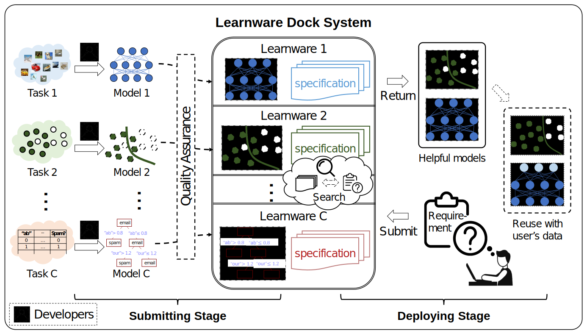
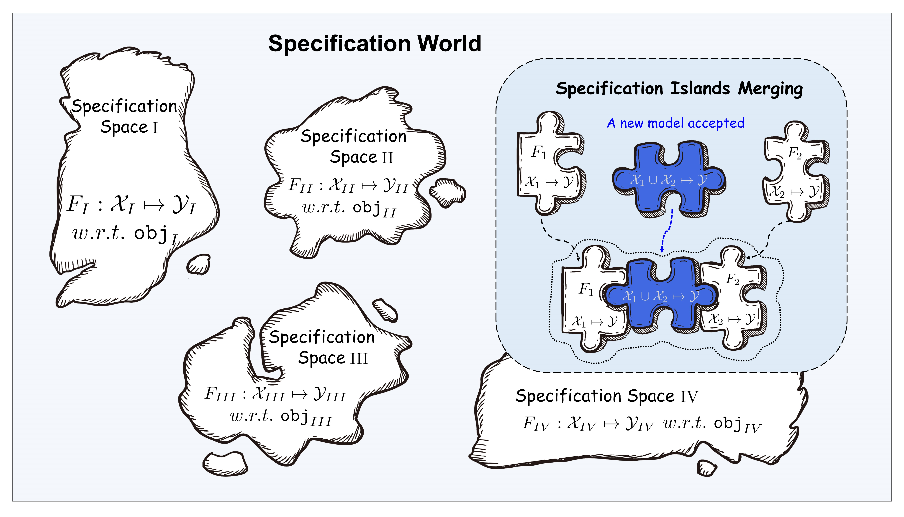

# Beimingwu: Learnware Dock System

Beimingwu is based on the Learnware paradigm, which systematically implements the entire process of Learnware from upload to deployment, helping users effectively search and reuse Learnware without the need to build machine learning models from scratch.

## What is Learnware?

Learnware consists of high-performance machine learning models and specifications that describe the models, i.e., "Learnware = Model + Specification."

Learnware specifications consist of "Semantic Specifications" and "Statistical Specifications":
- Semantic Specifications describe the type and functionality of the model through text.
- Statistical Specifications characterize the statistical information contained in the model using various machine learning techniques.

Specifications of Learnware describe the model's capabilities, enabling the model to be identified and reused fully by future users who know nothing about the Learnware in advance to meet their needs.

## Why Do We Need the Learnware Dock System?

Machine learning has achieved great success in many fields but still faces various challenges, such as the need for extensive training data and advanced training techniques, the difficulty of continuous learning, the risk of catastrophic forgetting, and the leakage of data privacy/ownership.

Although there is research addressing each of these issues individually, they are interconnected, and solving one problem may exacerbate others.

The Learnware Dock System aims to address many of these challenges through a unified framework:
- **Lack of Training Data/Skills**: Even for ordinary users with limited data and machine learning knowledge, they can obtain powerful machine learning models from the Learnware Dock System. Users can acquire high-performance Learnware and further customize or improve them without starting from scratch.
- **Continuous Learning**: As high-performance Learnware is continually submitted for various tasks, the knowledge in the Learnware Dock System will naturally accumulate, achieving continuous and lifelong learning.
- **Catastrophic Forgetting**: Once Learnware is accepted, it will always be retained in the Learnware Dock System unless it can be replaced by other Learnware in all aspects. Therefore, old knowledge in the Learnware Dock System is always preserved and never forgotten.
- **Data Privacy/Ownership**: Developers only submit models without sharing private data, thus protecting data privacy and ownership. Although the possibility of reverse engineering the model cannot be completely eliminated, the risk of privacy leakage in the Learnware Dock System is minimal compared to many other privacy protection schemes.

## How Does the Learnware Dock System Work?

The Learnware Dock System is the core entity in the Learnware paradigm. In the Learnware paradigm, there are three essential entities:
- **Developers**: Typically machine learning experts who produce and wish to share/sell their high-performance machine learning models.
- **Users**: In need of machine learning services but often have limited data and lack machine learning knowledge and skills.
- **Learnware Dock System**: Receives high-performance machine learning models from developers, incorporates them into the system, and provides services to users by identifying and reusing Learnware to help users solve current tasks.

As shown in the diagram below, the system workflow consists of two stages:

- **Submitting Stage**: Developers voluntarily submit various Learnware to the Learnware Dock System, and the system conducts quality checks and further organization of these Learnware.
- **Deploying Stage**: When users submit task requirements, the Learnware Dock System automatically selects whether to recommend a single Learnware or a combination of multiple Learnware and provides efficient deployment methods. Whether it's a single Learnware or a combination of multiple Learnware, the system offers convenient Learnware reuse interfaces.

### World of Specifications

Specifications are the core components of the Learnware Dock System, linking all processes related to Learnware, including uploading, organizing, searching, deploying, and reusing Learnware.

Learnware from different feature/markup spaces form numerous islands of specifications, and all these islands together constitute the "World of Specifications" in the Learnware Dock System. In the World of Specifications, if connections between different islands can be discovered and established, the corresponding islands of specifications can be merged.

When searching in the Learnware Dock System, the system first identifies specific islands of specifications based on semantic specifications in user requirements, and then it accurately recognizes Learnware on the specification islands through statistical specifications in user requirements.

Merging different specification islands means that the corresponding Learnware can be used in tasks with different feature/markup spaces, i.e., they can be reused in tasks beyond their original purposes.

## What Features Does the Beimingwu System Have?

Beimingwu systematically implements the core process of the Learnware paradigm for the first time:

- **Submitting Stage**: The system includes multiple detection mechanisms to ensure the quality of uploaded Learnware. Additionally, the system trains a heterogeneous engine based on existing Learnware specifications in the market to merge different specification islands and assign new specifications to Learnware. With more Learnware submissions, the heterogeneous engine will continue to update, achieving continuous iteration of Learnware specifications and building a more precise World of Specifications.
- **Deploying Stage**: After users upload task requirements, the system automatically selects whether to recommend single Learnware or multiple Learnware combinations and provides efficient deployment methods. Whether it's a single Learnware or a combination of multiple Learnware, the system offers convenient Learnware reuse interfaces.

In addition, the Beimingwu system also has the following features:

- **Learnware Specification Generation**: The Beimingwu system provides specification generation interfaces in the `learnware` Python package, supporting various data types (tables, images, and text) for efficient local generation.
- **Learnware Quality Inspection**: The Beimingwu system includes multiple detection mechanisms to ensure the quality of each Learnware in the system.
- **Diverse Learnware Search**: The Beimingwu system supports both semantic specifications and statistical specifications searches, covering data types such as tables, images, and text. In addition, for table-based tasks, the system also supports the search for heterogeneous table Learnware.
- **Local Learnware Deployment**: The Beimingwu system provides interfaces for Learnware deployment and Learnware reuse in the `learnware` Python package, facilitating users' convenient and secure Learnware deployment.
- **Data Privacy Protection**: Learnware Dock System operations, including Learnware upload, search, and deployment, do not require users to upload local data. All relevant statistical specifications are generated locally by users, ensuring data privacy.
- **Fully Open Source**: The Beimingwu system's source code is completely open-source, including the `learnware` Python package and front-end/back-end code. The `learnware` package is highly extensible, making it easy to integrate new specification designs, Learnware system designs, and Learnware reuse methods in the future.

Beimingwu is the first system-level implementation of the Learnware paradigm, and there is still significant room for improvement in related technologies. We invite you to experience it and provide valuable feedback for the continuous improvement of the system.