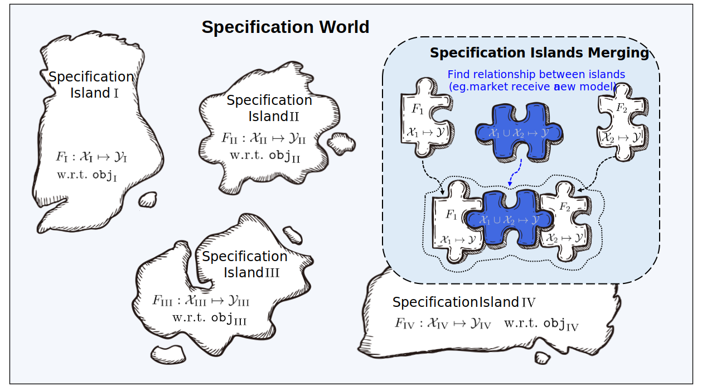

# Beimingwu: A Learnware Dock System

_Learnware_ was proposed by Professor Zhi-Hua Zhou in 2016 [1, 2]. In the _learnware paradigm_, developers worldwide can share models with the _learnware dock system_, which effectively searches for and reuse learnware(s) to help users solve machine learning tasks efficiently without starting from scratch.

Beimingwu is the first systematic open-source implementation of learnware dock system, providing a preliminary research platform for learnware studies. Developers worldwide can submit their models freely to the learnware dock. They can generate specifications for the model with the help of Beimingwu without disclosing their raw data, and then the model and specification can be assembled into a learnware, which will be accommodated in the learnware dock. Future users can solve their tasks by submitting their requirements and reusing helpful learnwares returned by Beimingwu, while also not disclosing their own data. It is anticipated that after Beimingwu accumulates millions of learnwares, an "emergent" behavior may occur: machine learning tasks that have never been specifically tackled may be solved by assembling and reusing some existing learnwares.

[1] Zhi-Hua Zhou. Learnware: on the future of machine learning. _Frontiers of Computer Science_, 2016, 10(4): 589–590  
[2] Zhi-Hua Zhou. Machine Learning: Development and Future. _Communications of CCF_, 2017, vol.13, no.1 (2016 CNCC keynote)

## What is Learnware?

A learnware consists of high-performing machine learning models and specifications that characterize the models, i.e., "Learnware = Model + Specification."

The learnware specification consists of "semantic specification" and "statistical specification":
- semantic specification describes the type and functionality of the model through text.
- statistical specification characterizes the statistical information contained in the model using various machine learning techniques.

Learnware specifications describe the model's capabilities, enabling the model to be identified and reused by future users who may know nothing about the learnware dock system in advance.

## Why Do We Need the Learnware Dock System?

Machine learning has achieved great success in many fields but still faces various challenges, such as the need for extensive training data and advanced training techniques, the difficulty of continuous learning, the risk of catastrophic forgetting, and the risk of data privacy breach.

Although many efforts focus on one of these issues separately, these efforts pay less attention to the fact that most issues are entangled in practice, and solving one may exacerbate others.

The learnware dock system aims to address many of these challenges through a unified framework:
- **Lack of Training Data/Skills**: Even for ordinary users with limited data and machine learning knowledge, they can obtain powerful machine learning models from the learnware dock system. Users can acquire high-performing learnwares and further customize or improve them without starting from scratch.
- **Continuous Learning**: As high-performing learnwares are continually submitted for various tasks, the learnware doc system will continuously expand its knowledge base and improve its capabilities, naturally realizing lifelong learning.
- **Catastrophic Forgetting**: Once a learnware passes the quality checks, it will always be stored in the learnware dock system. Therefore, old knowledge in the learnware dock system is always preserved and never forgotten.
- **Data Privacy/Ownership**: Developers freely submit their high-performing models to the learnware doc system, without revealing their training data. The learnware paradigm enables developers to share their models that can be adequately identified and reused by future users without disclosing developer's original data.

## How Does the Learnware Dock System Work?

The learnware dock system is the core entity in the Learnware paradigm. In the learnware paradigm, there are three essential entities:
- **Developers**: Typically machine learning experts who produce and wish to share/sell their high-performing machine learning models.
- **Users**: In need of machine learning services but often have limited data and lack machine learning knowledge and skills.
- **Learnware Dock System**: Receives high-performing machine learning models from developers, incorporates them into the system, and provides services to users by identifying and reusing learnware to help users solve current tasks.

As shown in the diagram below, the system workflow consists of two stages:

- **Submitting Stage**: Developers voluntarily submit various learnwares to the learnware dock system, and the system will conduct quality checks and further organization of these learnwares.
- **Deploying Stage**: The user submits her task requirement to the learnware doc system, and the system will identify and return some helpful learnwares to the user based on specifications, which can be further reused on user data.

### Specification World

Specification is the central component of the learnware dock system, linking all processes about learnwares, including uploading, organizing, searching, deploying, and reusing.

Learnwares from different feature/label spaces form numerous islands of specifications, and all these islands together constitute the "specification world" in the learnware dock system. In the specification world, if connections between different islands can be discovered and established, the corresponding islands of specification can be merged.

When searching in the learnware dock system, the system first identifies specific islands of specifications based on semantic specifications in user requirements, and then it accurately recognizes learnwares on the specification islands through statistical specifications in user requirements. Merging different specification islands means that the corresponding learnwares can be used in tasks with different feature/label spaces, i.e., they can be reused in tasks beyond their original purposes.

The learnware paradigm leverages the community-shared machine learning models to create a unified specification space, efficiently addressing new user tasks in a standardized manner. As more learnwares are submitted and the algorithms advance, the doc system will continuously expand its knowledge base and improve its capability to tackle more varied user tasks.

## How is Beimingwu System Organized?

As depicted in the figure below, Beimingwu's architecture consists of four hierarchical layers, from the learnware storage layer to the user interaction layer, systematically implementing the learnware paradigm for the first time from the ground up.

The functionalities of the four layers are described as follows:
- **Learnware Storage Layer**: Manage the storage of learnwares in zip packages and provides access to them through the learnware database.
- **Core Engine Layer**: Encompass all processes within the learnware paradigm, including the submitting, usability testing, organization, identification, deployment and reuse of learnwares, and operate independently of the backend and frontend in the form of the `learnware` Python package, providing rich algorithmic interfaces for learnware-related tasks and research experiments.
- **System Backend Layer**: Enable industrial-level deployment of Beimingwu, offering stable online deployment and providing extensive backend APIs for frontend and client interactions.
- **User Interface Layer**: Comprise a web-based frontend and a command-line client for user convenience and interaction.

  

## What Features Does the Beimingwu System Have?

The Beimingwu learnware dock system, serving as a preliminary research platform for learnware, systematically implements the core processes of the learnware paradigm for the first time:

- **Submitting Stage**: The system includes multiple detection mechanisms to ensure the quality of uploaded learnwares. Additionally, the system trains a heterogeneous engine based on existing learnware specifications in the system to merge different specification islands and assign new specifications to learnwares. With the submission of more learnwares, the heterogeneous engine will continually update, aiming to construct a more precise specification world through the constant iteration of learnware specifications.
- **Deploying Stage**: After users upload task requirements, the system automatically selects whether to recommend a single learnware or multiple learnware combinations and provides efficient deployment methods. Whether it's a single learnware or a combination of multiple learnwares, the system offers baseline learnware reuse methods in a uniform format for convenient usage.

In addition, the Beimingwu system also has the following features:

- **Learnware Specification Generation**: The Beimingwu system provides specification generation interfaces in the `learnware` Python package, supporting various data types (tables, images, and text) for efficient local generation.
- **Learnware Quality Inspection**: The Beimingwu system includes multiple detection mechanisms to ensure the quality of each learnware in the system.
- **Diverse Learnware Search**: The Beimingwu system supports both semantic specifications and statistical specifications searches, covering data types such as tables, images, and text. In addition, for table-based tasks, the system preliminarily supports the search for heterogeneous table learnwares.
- **Local Learnware Deployment**: The Beimingwu system provides a unified user interface for learnware deployment and reuse in the `learnware` Python package, facilitating users' convenient deployment and reuse of arbitrary learnwares.
- **Raw Data Protection**: The Beimingwu system operations, including learnware submission, identification, and deployment, do not require users to upload raw data. All relevant statistical specifications are generated locally by users using open-source API.
- **Open Source System**: The Beimingwu system's source code is open-source, including the `learnware` Python package and frontend/backend code. The `learnware` package is highly extensible, making it easy to integrate new specification designs, learnware system designs, and learnware reuse methods in the future.

Building the learnware paradigm requires collective efforts from the community. As the first learnware dock system, Beimingwu is still in its early stages, with much room for improvement in related technologies. We sincerely invite the community to upload models, collaborate in system development, and engage in research and enhancements in learnware algorithms. Your valuable feedback is essential for the continuous improvement of the system.