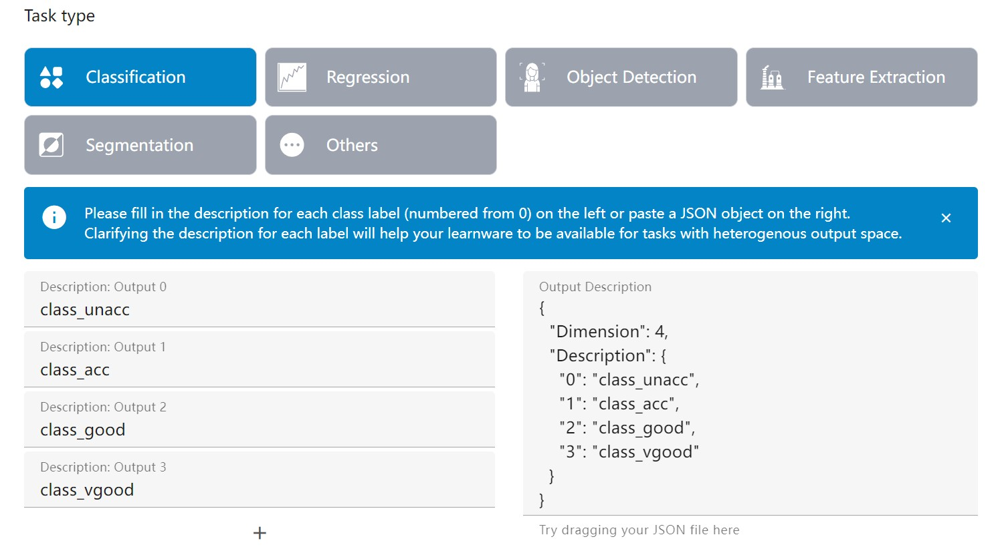

# Upload Learnwares via Web Interface

In the Beimingwu system, you can upload a learnware both from the web interface and by using the `learnware` Python package.

Next, we will explain how to upload learnware using the web interface.

## Step 1: Fill in the Learnware Name

Click the "Submit" button on the website's navigation bar at [Submit](https://www.bmwu.cloud/#/submit) to begin the process of uploading learnware.

The first step is "Fill in the Learnware Name", as shown on the specific page below:

It should be noted here that the "Learnware Name" needs to be between 5 to 50 characters in length.

## Step 2：Choose the Learnware Tags

After filling in the learnware name, proceed to the second step: choose the learnware tags.

First, select the "Data type" involved in the learnware. If `Table` is chosen, you need to specify the semantics of each dimension of the model's input data to make the uploaded learnware suitable for tasks with heterogeneous feature spaces.

If there are many dimensions, consider using a large language model to analyze the feature engineering code and generate semantics for each dimension.

Next is selecting the "Task type" involved in the learnware. If `Classification` is chosen, you need to provide the semantics of model output labels (prediction labels start from 0), making the uploaded learnware suitable for classification tasks with heterogeneous output spaces.

If `Regression` is chosen, you need to specify the semantics of each dimension of the model output, making the uploaded learnware suitable for regression tasks with heterogeneous output spaces.

Finally, select the "Library type", "Scenario", and "License" for the learnware, based on the specific content of the tags.

## Step 3：Fill in the Learnware Description

After selecting the learnware tags, you can proceed to the third step: fill in the learnware description, which supports markdown format.

Additionally, it's important to note that the "Learnware Description" should be between 10 to 10,000 characters in length.

## Step 4：Upload the Learnware zip Package

After completing the learnware description, you can proceed to the final step: upload the learnware zip package.

The preparation of the learnware zip package can be referred to: [How to Prepare a Learnware?](/en/user-guide/learnware-upload/prepare)

Once your learnware is successfully uploaded, you can find it under "Personal Information - My Learnware."

After uploading, the backend will perform a check on the learnware. Once the check passes, the learnware's tag will change to "SUCCESS", and your uploaded learnware will appear in the system.