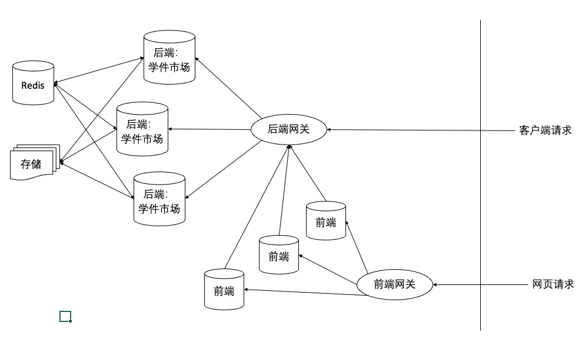

# 北冥系统后端开发指南

## 后端架构图

## 功能开发
### 技术栈
Flask + SqlAlchemy + Redis
### 数据库
表结构定义：database/sqlalchemy.py

数据库操作：lib/database_operations.py

### 后端接口
用户相关接口：restful/user.py

登陆相关接口：restful/auth.py

学件市场相关接口：restful/engine.py

管理员相关接口：restful/admin.py

### 测试用例
用户相关测试用例：tests/test_user.py

登陆相关测试用例：tests/test_auth.py

学件市场相关测试用例：tests/test_engine.py

管理员相关测试用例：tests/test_admin.py

### 主要任务入口

后端服务：scripts/main.py

数据备份：scripts/backup_data.py

学件验证：scripts/monitor_learnware_verify.py