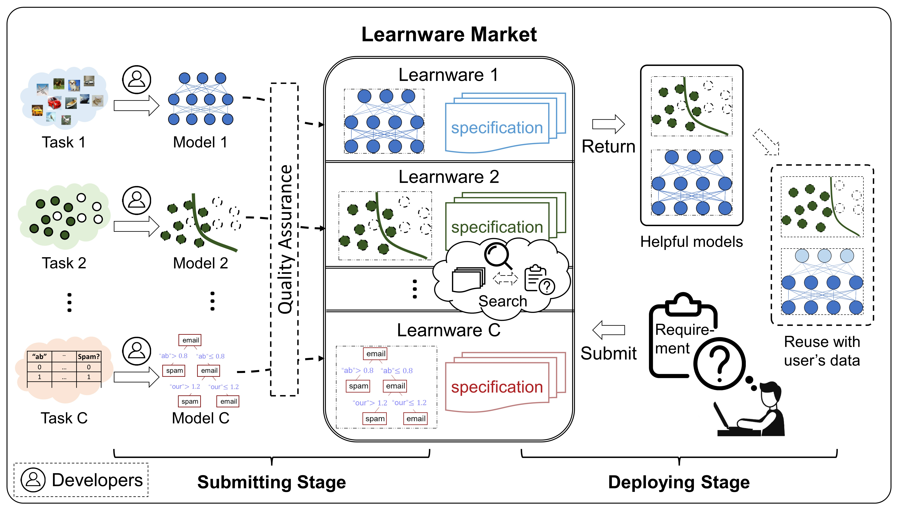

# 系统介绍

## 北冥坞：学件基座系统是什么

北冥坞：学件基座系统是学件范型系统级实现的示例，包含学件的上传、组织、查搜和复用。北冥坞能够系统地组织开发者上传的学件，并帮助用户查搜复用对当前任务有帮助的学件而不必从零开始。

## 学件范型

目前机器学习在很多领域取得了巨大的成功，但是也暴露出诸多问题：训练一个好模型的条件苛刻（大量高质量有标记数据，高算力机器，专家经验）；模型在不断适应新任务时会出现灾难性遗忘；数据隐私阻碍了在不同的用户间分享经验等；模型通常是为特定任务设计的，难以复用到其他任务上等。虽然目前针对每一个问题有专门的研究，但由于问题间是相互耦合的，在解决一个问题的时候，其他的问题可能会变得更加严重。学件范型希望能通过一个整体的框架同时解决机器学习目前存在的一些主要问题。学件范型期望系统的组织和复用模型来完成甚至超出其原始目的的任务，并使用户无需从零开始构建他们的机器学习模型。

学件由性能优良的模型和描述其能力的**规约**构成。学件的规约包含两部分：语义规约和统计规约。语义规约通过文本描述模型及其相关的任务，而统计规约则刻画了模型蕴含的统计信息。**规约世界**是所有学件的规约所构成的空间，其包含了很多个子空间称之为**规约岛**。语义规约能够帮助定位到模型规约所在的岛屿，而统计规约则能够确定模型规约在规约岛上的精确位置。

学件范型的流程主要包含两个阶段：

- 提交阶段：开发者自发地提交各式各样的学件到**学件市场**，学件市场会对这些学件进行质量检查和进一步的组织。
- 部署阶段：当用户提交任务需求后，学件市场会根据规约推荐对用户任务有帮助的学件并指导用户进行复用。

规约是学件的核心构件，如果没有规约，市场在判断哪些模型对用户任务有帮助时，需要遍历市场中所有的模型及其组合，这在数据隐私和计算效率方面是不可接受的。

当市场基于统计规约进行查搜时，查搜将会局限于某一固定的规约岛。而对于学件市场收集到的学件，其规约散布在不同的规约岛中。为了使得基于统计信息的查搜能覆盖到市场中所有的学件，市场会对学件进行进一步的组织，将不同的规约岛合并为一个，称之为**规约世界**。

## 系统特性

北冥坞系统首次以系统级的方式实现了学件范型的核心流程：

- **提交阶段**：系统提供了多重机制以确保上传学件的质量。一旦学件的数量达到一定程度，系统将利用现有学件的规约来训练一个引擎，这个引擎能够将分散在各个规约空间的学件整合到同一个规约世界中，并为这些学件赋予独特的新规约。随着更多学件的上传，该引擎将持续更新，以构建更加精准的规约世界，从而实现学件规约的持续迭代。
- **部署阶段**：用户上传任务需求后，系统会自动选择是推荐单个学件还是多个学件的组合，并提供一键式部署服务。用户既可以直接使用学件进行预测，也可以用自己的数据进行微调。无论是单个学件还是多个学件的组合，系统均提供了便捷的复用工具。

此外，北冥坞系统还具备以下特性：

- **高度可扩展的接口设计**：核心组件为learnware包，该Python包对学件范型中的关键概念（如规约、学件、学件市场）以及核心流程（包括学件检查、组织、查搜、复用）进行了系统级实现和优化，并且具有高度的可扩展性。这意味着未来新的规约设计、学件市场设计、学件复用方法的出现都能轻松集成至learnware包中。
- **规约生成支持多种数据类型，同时保护数据隐私**：规约作为学件的核心组件和用户提交任务需求的载体，对于保护数据隐私至关重要。北冥坞系统提供的工具支持多种数据类型（如表格、图像、文本）的统计规约生成，所有计算过程均在本地完成，不涉及数据上传，有效保障了开发者和用户的隐私安全。
- **多学件查搜能力**：得益于规约的存在，学件市场能够基于用户任务的统计和语义信息进行查搜。在一些情况下，市场中的单个学件可能与用户任务高度匹配；在其他情况下，尽管市场中可能没有完全匹配的单个学件，但系统会尝试多个学件的组合来满足用户任务的统计需求，实现多学件查搜。
- **对异构表格模型查搜复用的初步支持**：多模态数据很少遇到异构特征空间的问题，但对于表格数据，异构性却十分常见。北冥坞系统首次尝试在无需辅助数据、不接触原始数据的条件下，通过规约世界解决异构表格模型查搜复用的问题。

北冥坞：学件基座系统代表了学件范型的首个系统级实现。虽然其基础搭建得相对扎实，但相关技术仍有改进空间。我们诚邀各位体验并为系统的持续改进提出宝贵意见。