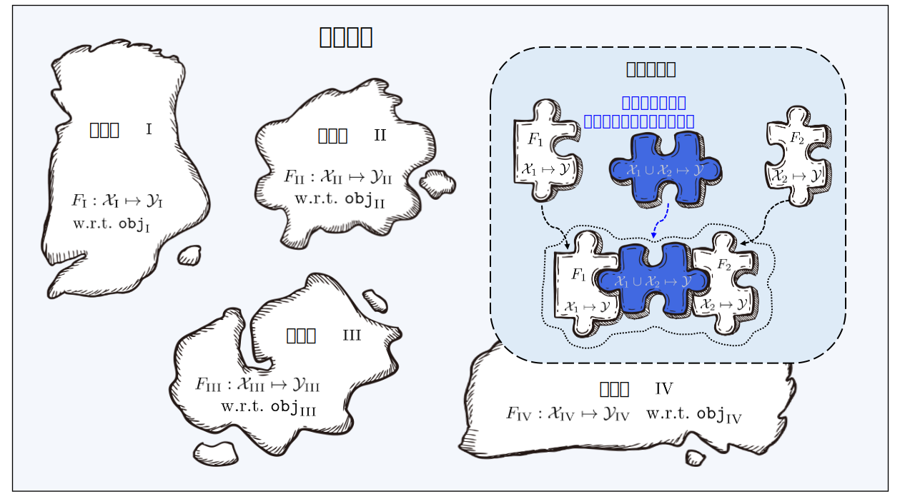

# 北冥坞：学件基座系统

学件范式由周志华教授在2016年提出 [1, 2]，旨在构建一个巨大的模型平台系统：即学件基座系统，系统地组织管理世界各地的机器学习开发者分享的模型，并通过统一的方式识别、利用已有模型的能力快速解决新的机器学习任务。

北冥坞基于学件范式，首次系统性地实现了学件从上传到部署的完整流程，帮助用户有效查搜和复用学件，而无需从零开始构建机器学习模型。

[1] Zhi-Hua Zhou. Learnware: on the future of machine learning. _Frontiers of Computer Science_, 2016, 10(4): 589–590  
[2] 周志华. 机器学习: 发展与未来. 中国计算机学会通讯, 2017, vol.13, no.1 (2016 中国计算机大会 keynote)

<!-- ## 学件范式

目前机器学习在很多领域取得了巨大的成功，但是也暴露出诸多问题：
- 训练一个好模型的条件苛刻（大量高质量有标记数据，高算力机器，专家经验）；
- 面对不断变化的环境，模型难以适应且可能出现灾难性遗忘；
- 数据隐私阻碍了不同用户间经验的分享；
- 模型通常是为特定任务设计的，难以复用到其他任务上；
- ......

虽然目前上述每一个问题都有相应的研究，但由于问题间是相互耦合的，在解决其中一个问题时，可能会导致其他问题变得更加严重。

学件范式期望通过一个整体框架同时解决上述诸多问题。学件范型期望系统的组织和复用模型来完成甚至超出其原始目的的任务，并使用户无需从零开始构建他们的机器学习模型。 -->

## 学件是什么？

学件由性能优良的机器学习模型和描述模型的**规约**构成，即「学件 = 模型 + 规约」。

学件的规约由「语义规约」和「统计规约」两部分组成：
- 语义规约通过文本对模型的类型及功能进行描述；
- 统计规约则通过各类机器学习技术，刻画模型所蕴含的统计信息。

学件的规约刻画了模型的能力，使得模型能够在未来用户事先对学件一无所知的情况下被充分识别并复用，以满足用户需求。

## 为什么需要学件基座系统？

机器学习在很多领域取得了巨大成功，但依然面临着诸多问题，例如需要大量的训练数据和高超的训练技巧、持续学习的困难、灾难性遗忘的风险以及数据隐私/所有权的泄漏等。

虽然上述每一个问题都有相应的研究，但由于问题之间是相互耦合的，在解决其中一个问题时，可能会导致其他问题变得更加严重。

学件基座系统期望通过一个整体框架，同时解决上述诸多问题：
- **缺乏训练数据/技能**：即使对于缺乏训练技能或数据量较小的普通用户，也可以获得强大的机器学习模型，因为用户可以从学件基座系统中获取性能优良的学件，并进一步调整或改进，而不是自己从头开始构建模型。
- **持续学习**：随着在各种不同任务上训练得到的、性能优良的学件被不断提交，学件基座系统中的知识将不断丰富，进而自然地实现持续和终身学习。
- **灾难性遗忘**：一旦学件被接收，它将永远被容纳在学件基座系统中，除非其各方面功能都可以被其他学件所替代。因此，学件基座系统中的旧知识总是会被保留，而不会被遗忘。
- **数据隐私/所有权**：开发者只提交模型而不共享私有数据，因此数据隐私/所有权可以得到很好的保护。尽管无法完全排除对模型进行逆向工程的可能性，但与许多其它隐私保护方案相比，学件基座系统泄露隐私的风险非常小。

## 学件基座系统是如何工作的？

学件基座系统是学件范式的核心实体。在学件范式中，共有三个重要实体：
- **开发者**：通常是机器学习专家，生产并希望分享/出售他们性能优良的机器学习模型。
- **用户**：需要机器学习服务，但通常只拥有有限的数据，并且缺乏机器学习知识和技能。
- **学件基座系统**：从开发者那里接收性能优良的机器学习模型，将它们纳入系统，并通过识别和复用学件向用户提供服务，以帮助用户解决当前的任务。

如下图所示，系统工作流程分为以下两个阶段：

- **提交阶段**：开发者自发地提交各式各样的学件到**学件基座系统**，而系统会对这些学件进行质量检查和进一步的组织。
- **部署阶段**：当用户提交任务需求后，**学件基座系统**会根据学件规约推荐对用户任务有帮助的学件并指导用户进行部署和复用。

### 规约世界

规约是学件基座系统的核心组件，串联了系统中关于学件的全部流程，包括学件上传、组织、查搜、部署与复用。

来自不同特征/标记空间的学件，构成众多的规约岛屿，所有规约岛屿共同构成学件基座系统中的**规约世界**。在规约世界中，如果能够发现并建立不同岛屿之间的联系，那么相对应的规约岛屿将可以进行合并。

学件基座系统在查搜时，首先通过用户需求中的语义规约定位到具体的规约岛屿，再通过用户需求中的统计规约对规约岛上的学件进行精确识别。

不同的规约岛屿合并，则意味着相应的学件可以被用于不同特征/标记空间的任务上，即可以复用至超出其原始目的的任务中。

## 北冥坞系统有哪些特性？

北冥坞首次系统性地实现了学件范式中的核心流程：

- **提交阶段**：系统内置了多重检测机制，以确保上传学件的质量。另外，系统会根据已有的学件规约，训练一个异构引擎，用于合并不同的规约岛屿，以及为学件赋予新规约。随着更多学件的上传，异构引擎将持续更新，实现学件规约的持续迭代，构建更精准的规约世界。
- **部署阶段**：用户上传任务需求后，系统会自动选择是推荐单学件还是多学件组合，并提供高效的部署方式。无论是单个学件还是多学件组合，系统均提供了便捷的学件复用接口。

此外，北冥坞系统还具备以下特性：

- **学件规约生成**：北冥坞系统在 `learnware` Python 包中提供规约生成接口，支持多种数据类型（表格、图像和文本），可以在本地高效生成。
- **学件质量检测**：北冥坞系统内置了多重检测机制，以确保系统中每个学件的质量。
- **学件多样查搜**：北冥坞系统同时支持语义规约和统计规约的查搜，覆盖的数据类型包括表格、图像、文本。另外，对于表格型任务，系统额外支持异构表格学件的查搜。
- **学件本地部署**：北冥坞系统在 `learnware` Python 包中同时提供学件部署与学件复用的接口，帮助用户便捷、安全的部署与复用学件。
- **数据隐私保护**：北冥坞系统所涉及的学件上传、查搜、部署均无需用户上传本地数据，所有涉及的统计规约均由用户本地生成，确保用户数据隐私。
- **系统完全开源**：北冥坞系统所有的源码全部开源，包括 `learnware` Python 包与前后端代码。其中 `leanrware` 包高度可扩展，未来新的规约设计、学件系统设计、学件复用方法都能轻松集成进来。

北冥坞系统是学件范式的首个系统级实现，相关技术仍有很大的改进空间。我们诚邀各位体验并为系统的持续改进提出宝贵意见。