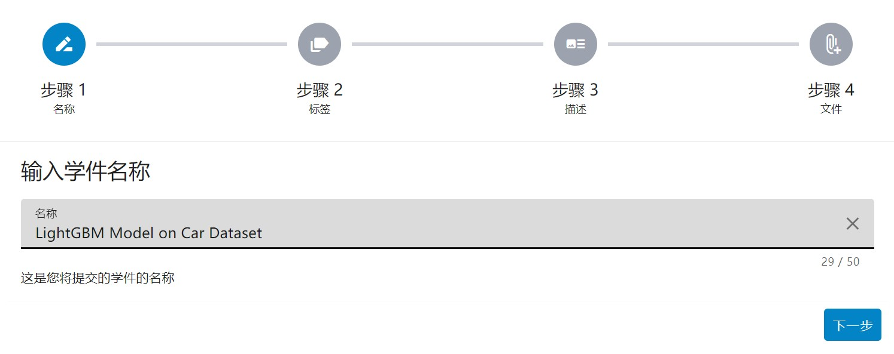
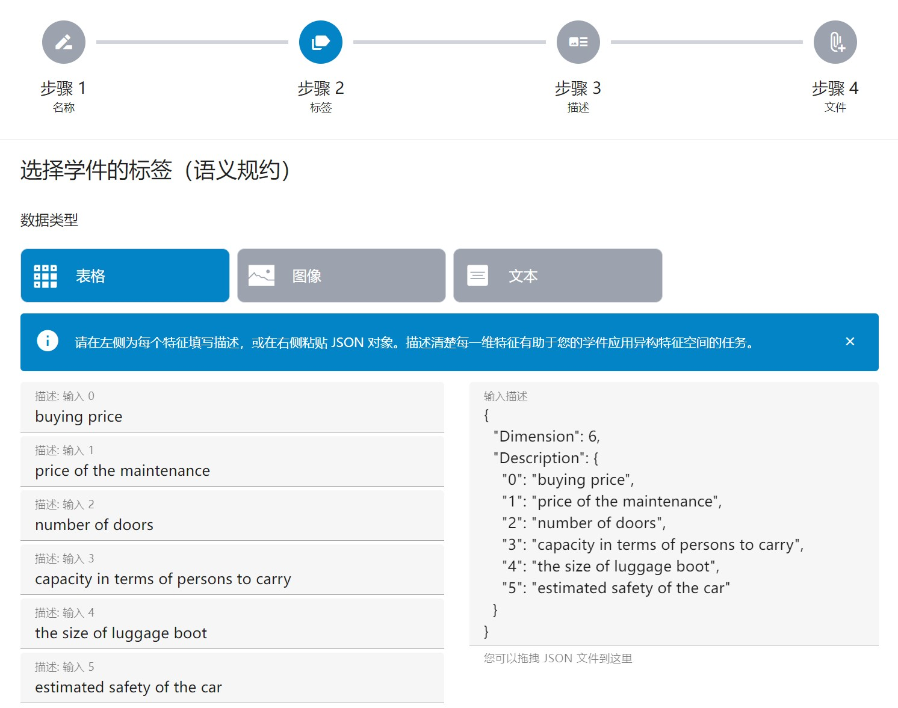
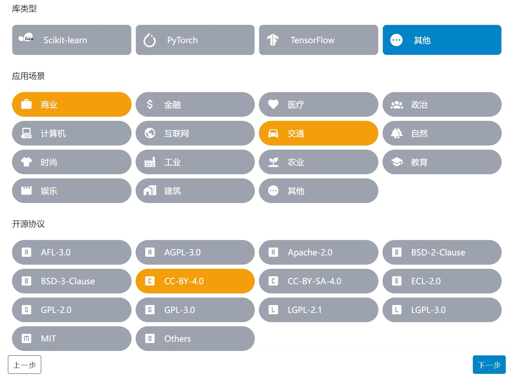
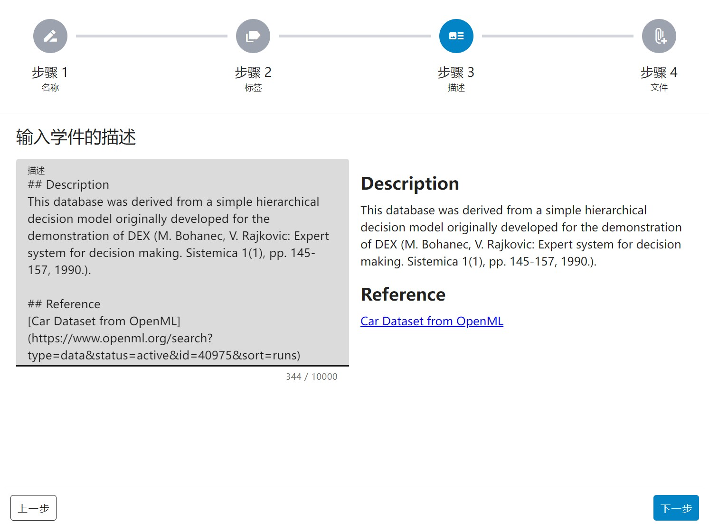
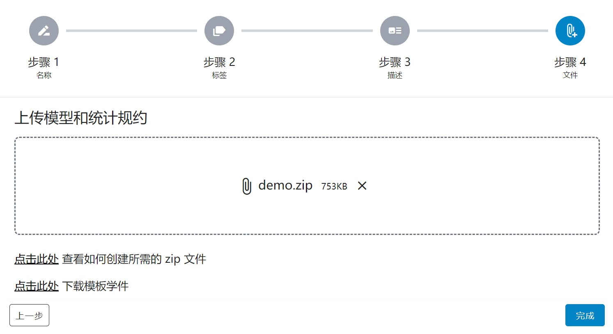

# 通过网页端上传学件

在北冥坞系统中，学件既可以从网页端上传，也可以使用 `learnware` Python 包进行上传。

接下来，我们将介绍如何使用网页端上传学件。

## 步骤 1：填写学件名称

点击网站导航栏处的「[提交](https://www.bmwu.cloud/#/submit)」按钮，即可开始学件上传。

首先是「第一步 - 填写学件名称」，具体页面如下所示：

此处需要注意「学件名称」需要控制在 5 至 50 个字符之间。

## 步骤 2：选择学件标签

填写完学件名称后，进入第二步：填写学件标签。

首先是选择学件所涉及的「数据类型」，此处如果选择「表格」，则需要填写模型输入数据的每一维特征语义，使上传的学件可用于异构特征空间的任务。

如果维度过多，可考虑使用大语言模型。通过分析特征工程的代码，生成各维度的语义。

随后是选择学件所涉及的「任务类型」，此处如果选择「分类」，则需要填写模型输出标记的语义（预测标记从 0 开始编号），使上传的学件可用于异构输出空间的分类任务。

如果选择「回归」，则需要填写模型输出的每一维语义，使上传的学件可用于异构输出空间的回归任务。

最后是选择学件的「库类型」、「应用场景」以及「开源协议」，根据具体标签内容选择即可。

## 步骤 3：填写学件描述

选择完学件标签后，即可进入第三步：填写学件描述，此处描述内容支持 `markdown` 格式。

另外需要注意「学件描述」需要控制在 10 至 10000 个字符之间。

## 步骤 4：上传学件 zip 包

填写完学件描述后，即可进入最后一步：上传学件 zip 包。

学件 zip 包的准备可查看：[如何准备一个学件？](/zh-CN/user-guide/learnware-upload/prepare)

学件上传成功后，可以在「个人信息 - 我的学件」处看到上传的学件。

学件上传后，后台会对学件进行检查。检查通过后，学件的标签将变为「验证成功」，且上传的学件会在系统中出现。